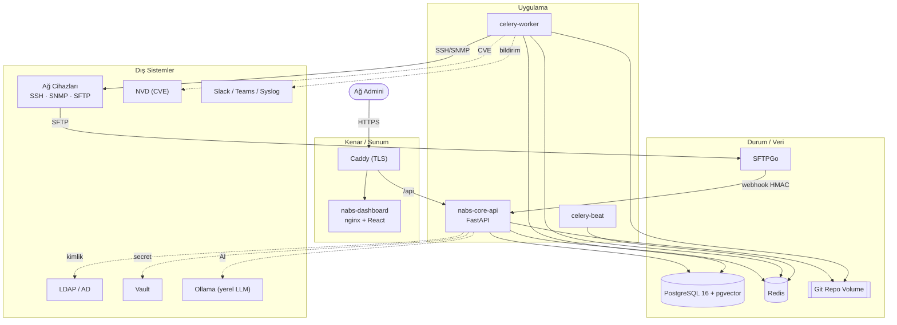
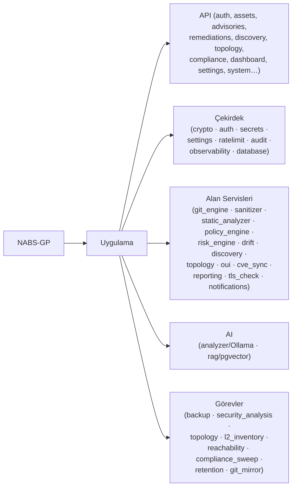
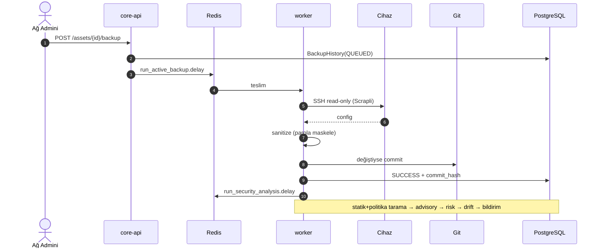
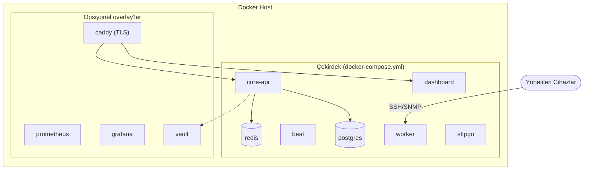

# NABS-GP — Mimari ve Mikroservis Topolojisi

Bu doküman NABS-GP'nin çözüm mimarisini, mikroservis topolojisini, servis ağacını, veri akışlarını ve dağıtım modelini anlatır. Satış öncesi teknik değerlendirme ve çözüm mimarları için hazırlanmıştır.

> Sürüm: 1.1.0 · Eşlik eden diyagramlar: `docs/diagrams/*.mermaid`

---

## 1. Çözüm özeti

NABS-GP (Network Asset, Backup & Security Governance Platform); heterojen çok-vendörlü ağ altyapılarında **konfigürasyon yedekleme + sürümleme**, **varlık & topoloji keşfi**, **güvenlik denetimi (statik + politika + CVE + yerel LLM)**, **risk skorlama**, **config drift/uyumluluk** ve **insan onaylı düzeltme yönetişimi**ni tek platformda birleştiren, ayrık ve olay-güdümlü bir mikroservis çözümüdür.

Tasarım ilkeleri: **fail-closed güvenlik** (secret'lar eksikse başlatmayı reddet), **onaysız cihaza-yazma yok** (read-only mimari), **yatay ölçeklenebilir asenkron işleme**, **veri gizliliği** (yerel LLM, dışa veri sızıntısı yok).

---

## 2. Mikroservis topolojisi

Ayrık, olay-güdümlü servisler. Senkron API katmanı, ağ I/O'sunu (SSH timeout'ları) asenkron worker'lara devreder.

| Servis | Teknoloji | Sorumluluk | Ölçekleme |
|---|---|---|---|
| **nabs-core-api** | FastAPI (Python 3.11, async) | REST API, JWT/RBAC, doğrulama, orkestrasyon | Yatay (stateless) |
| **celery-worker-high** | Celery + Redis | Yedekleme, tarama, keşif, drift, L2, CVE | Yatay (N worker) |
| **celery-beat** | Celery beat | Zamanlanmış görevler (cron) | Tekil (lider) |
| **nabs-dashboard** | React + nginx | NMS-tarzı GUI, /api proxy | Yatay |
| **nabs-db** | PostgreSQL 16 + pgvector | Kalıcı durum + vektör (RAG) | Dikey / replica |
| **nabs-redis** | Redis 7 | Celery broker/kuyruk + rate-limit | Dikey / cluster |
| **sftpgo** | SFTPGo | Air-gapped/pasif yedek girişi | Yatay |
| *caddy* (ops.) | Caddy 2 | TLS terminasyonu (otomatik HTTPS) | — |
| *prometheus/grafana* (ops.) | — | Metrik & gösterge panoları | — |
| *nabs-vault* (ops.) | HashiCorp Vault | Bootstrap secret backend | — |

Stateless API tasarımı sayesinde API ve worker konteynerleri sınırsız çoğaltılabilir; tüm durum PostgreSQL, Redis ve Git volume'unda tutulur.

---

## 3. Servis ağacı (modül hiyerarşisi)

Uygulama içi katmanlı yapı: API uçları → çekirdek servisler → alan servisleri / AI → asenkron görevler.

Tam detay: `docs/diagrams/service-tree.mermaid`.

---

## 4. Yedekleme veri akışı (aktif + pasif)

Pasif (air-gapped) yol: cihaz SFTP ile SFTPGo'ya push eder → HMAC imzalı webhook → path-traversal kontrolü → sanitize → commit → tarama. Tam dizi: `docs/diagrams/backup-flow.mermaid`.

---

## 5. Veri mimarisi

- **PostgreSQL 16 (+ pgvector):** assets, credentials (AES-256-GCM şifreli kasa), backup_history, security_advisories, remediation_actions (onay state machine), users, api_keys, audit_log (append-only), topology_links, discovered_hosts, config_baselines, app_settings, rag_chunks (vektör), network_zones.
- **Git deposu (volume):** her cihazın konfigürasyon sürüm geçmişi (diff/rollback kaynağı). **Tek kopya — off-host mirror ile korunur** (15 dk'da bir).
- **Redis:** Celery broker/kuyruk + login rate-limit sayaçları.
- **Şifreleme:** kimlik bilgileri AES-256-GCM ile uygulama katmanında şifrelenir; anahtar env ya da Vault'tan gelir (fail-closed). Yedeklerde bile parolalar şifreli kalır.

---

## 6. Güvenlik mimarisi (özet)

| Katman | Kontrol |
|---|---|
| Kimlik | JWT (Faz-1'den zorunlu) · opsiyonel LDAP/AD · TOTP MFA · API key (entegrasyon) |
| Yetki | Rol tabanlı (viewer/operator/approver/admin), uç bazında dependency |
| Secret | AES-256-GCM kasa · Vault/env (fail-closed) · secret maskeleme (çok-vendor) |
| Ağ girişi | Webhook HMAC-SHA256 (ham gövde) · path-traversal koruması |
| Değişiklik yönetişimi | Düzeltme onay state machine · dört-göz ilkesi · onaysız cihaza-yazma YOK |
| İzlenebilirlik | Append-only audit log · request-ID korelasyonu · immutable config geçmişi |
| Taşıma | TLS terminasyonu (Caddy) · GUI'den sertifika yönetimi |
| Sağlamlık | Login rate-limit · fail-closed başlatma · non-root konteynerler |

---

## 7. Dağıtım topolojisi

Çekirdek stack + isteğe bağlı overlay'ler (TLS, observability, Vault). Tümü Docker Compose ile; `install.sh` sihirbazı ile tek komut kurulum.

**Boyutlandırma (kaba):** 100-500 cihaz → 4 vCPU / 8 GB, 1 worker. 5.000 cihaz → 8+ vCPU / 16+ GB, çok worker + Redis/PG tuning. Worker'lar yatay ölçeklenir; API stateless.

Tam dağıtım/işletim: `docs/PRODUCTION_INSTALL.md`. Diyagram: `docs/diagrams/deployment-topology.mermaid`.

---

## 8. Teknoloji özeti

Backend: FastAPI · Pydantic v2 · SQLAlchemy 2 · Celery · Scrapli/paramiko · GitPython · cryptography · CiscoConfParse/TTP · pgvector.
Frontend: React 18 · Vite · bağımlılıksız SVG grafikler & topoloji haritası.
Altyapı: PostgreSQL 16 · Redis 7 · SFTPGo · Caddy · Prometheus/Grafana · HashiCorp Vault · Ollama (yerel LLM).
